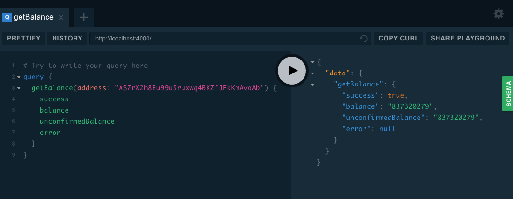

### [ARK GraphQL][arkgraphql]

  [arkgraphql]: https://ark-graphql.now.sh/ "ARK GraphQL"

#### GraphQL Server for ARK Blockchain



#### To run locally:

```
yarn
yarn start
```

#### Implemented API Calls
```
  getBalance(address: String): Balance
  getAccount(address: String): Account
  getTopAccounts: TopAccounts
  getDelegates(address: String): Delegates
  getTransaction(id: String): Transaction
  getTransactions(limit: String): Transactions
```

###  Support this project
```
ARK: AS7rX2h8Eu99uSruxwq4BKZfJFkKmAvoAb
```
